# Install MCP in VS Code Codex

[← All MCPs](README.md) · [Install WebDev Agent Kit for VS Code Codex](../install/vscode-codex.md)

This guide covers only MCP installation in the official Codex extension for
VS Code on Windows. Server purposes, skill relationships, and common test
prompts are in the [general MCP guide](README.md).

## Codex in VS Code

### Before You Begin

Node.js, npm, and npx must work for Filesystem and Playwright:

```powershell
node --version
npm --version
npx --version
```

### How to Open MCP Settings

1. Open the project in VS Code.
2. Open the Codex panel.
3. Select the gear icon and open **Codex Settings**.
4. Select **MCP servers**.
5. Select **Add server**.
6. Fill in the fields for the required MCP and select **Save**.
7. After changes, select **Restart extension** or restart VS Code completely.

The Codex CLI and extension use shared MCP configuration. User configuration is
stored in `~/.codex/config.toml`; project `.codex/config.toml` works only in a
trusted project.

The resulting list looks approximately like this:

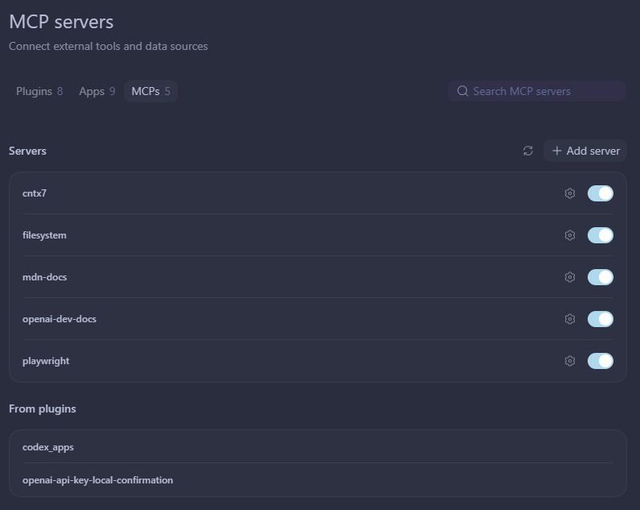

## Codex: Context7

### Create an API Key

If you use an API key instead of OAuth:

1. Open the [Context7 dashboard](https://context7.com/dashboard).
2. In the **API Keys** section, select **Create API Key**.
3. Name the key `pc-vs-code-codex`.
4. Create and immediately copy the key: it is not shown again.
5. Do not store the key in Markdown, git, or `AGENTS.md`.

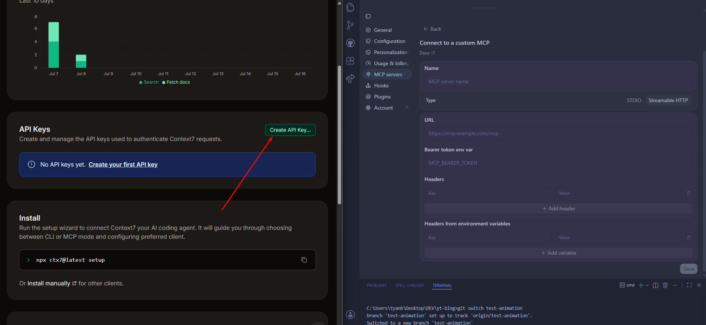

On the next screen, name the key `pc-vs-code-codex` and select **Create API Key**:

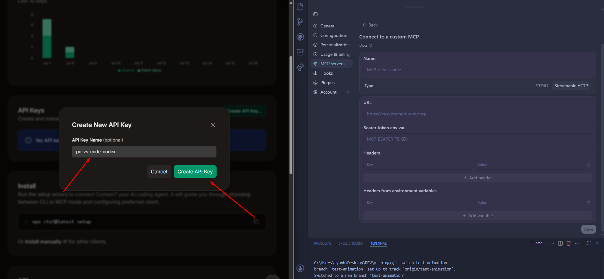

### Configuration Shown in the Screenshot

In **MCP servers → Add server**, enter:

| Field | Value |
| --- | --- |
| Name | `cntx7` |
| Type | `Streamable HTTP` |
| URL | `https://context7.com/` |
| Bearer token env var | `<YOUR_CONTEXT7_API_KEY>` |

Select **Save**.

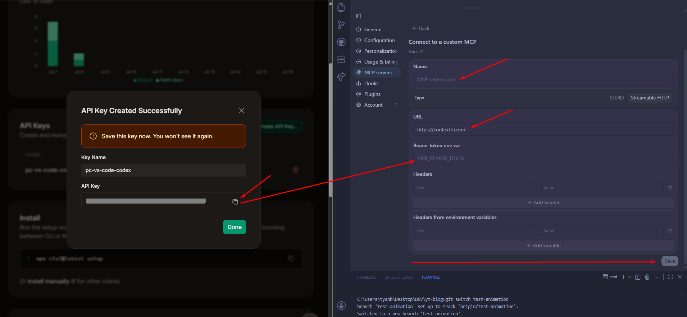

> This option matches the screenshot. Current official Context7 documentation
> uses a different endpoint and header. If the server does not connect, apply
> the current configuration below.

### Current Configuration Through an Environment Variable

Create a local Windows variable:

```powershell
setx CONTEXT7_API_KEY "<YOUR_CONTEXT7_API_KEY>"
```

Restart VS Code completely, then enter:

| Field | Value |
| --- | --- |
| Name | `cntx7` |
| Type | `Streamable HTTP` |
| URL | `https://mcp.context7.com/mcp` |
| Headers from environment variables — Key | `CONTEXT7_API_KEY` |
| Headers from environment variables — Value | `CONTEXT7_API_KEY` |

The first value is the HTTP header name; the second is the name of the
environment variable containing the secret.

Equivalent `config.toml`:

```toml
[mcp_servers.cntx7]
url = "https://mcp.context7.com/mcp"
env_http_headers = { "CONTEXT7_API_KEY" = "CONTEXT7_API_KEY" }
```

Fallback CLI command:

```powershell
codex mcp add cntx7 -- npx -y @upstash/context7-mcp --api-key "<YOUR_CONTEXT7_API_KEY>"
```

The command containing the key may remain in terminal history, so an environment
variable is preferred for permanent configuration.

## Codex: Filesystem

Copy the absolute path to the required project. In **Add server**, enter:

| Field | Value |
| --- | --- |
| Name | `filesystem` |
| Type | `STDIO` |
| Command to launch | `cmd` |

Add the arguments on separate lines:

```text
/c
npx
-y
@modelcontextprotocol/server-filesystem
<ABSOLUTE_PATH_TO_PROJECT>
```

You can leave Working directory empty. Allow only the required project
directory, not the drive root or the entire user profile.

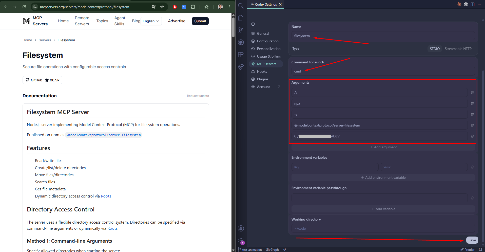

Fallback CLI command:

```powershell
codex mcp add filesystem -- cmd /c npx -y @modelcontextprotocol/server-filesystem "<ABSOLUTE_PATH_TO_PROJECT>"
```

Equivalent `config.toml`:

```toml
[mcp_servers.filesystem]
command = "cmd"
args = [
  "/c",
  "npx",
  "-y",
  "@modelcontextprotocol/server-filesystem",
  "C:\\full\\path\\to\\project",
]
```

## Codex: MDN

In **Add server**, enter:

| Field | Value |
| --- | --- |
| Name | `mdn-docs` |
| Type | `Streamable HTTP` |
| URL | `https://mcp.mdn.mozilla.net/` |

To opt out of first-party analytics, add under **Headers**:

| Key | Value |
| --- | --- |
| `X-Moz-1st-Party-Data-Opt-Out` | `1` |

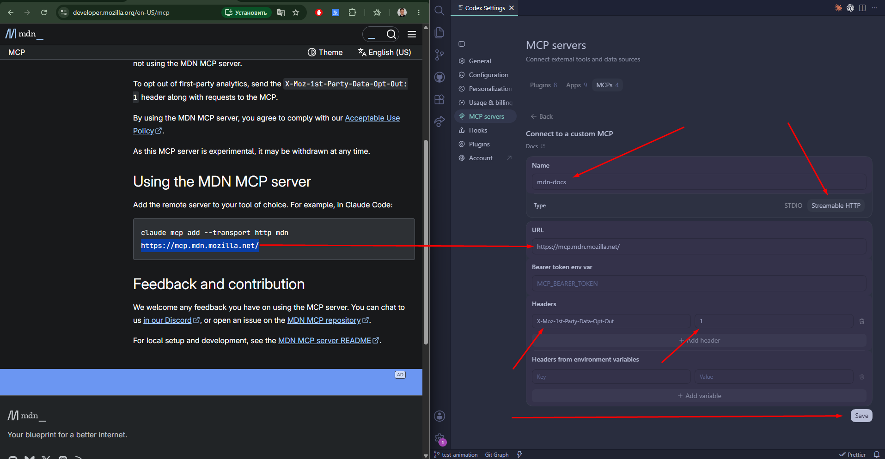

CLI without the opt-out header:

```powershell
codex mcp add mdn-docs --url https://mcp.mdn.mozilla.net/
```

Configuration with the header:

```toml
[mcp_servers.mdn-docs]
url = "https://mcp.mdn.mozilla.net/"
http_headers = { "X-Moz-1st-Party-Data-Opt-Out" = "1" }
```

## Codex: OpenAI Docs

In **Add server**, enter:

| Field | Value |
| --- | --- |
| Name | `openai-dev-docs` |
| Type | `Streamable HTTP` |
| URL | `https://developers.openai.com/mcp` |

Leave the bearer token and headers empty. This server is for documentation only
and does not require an OpenAI API key.

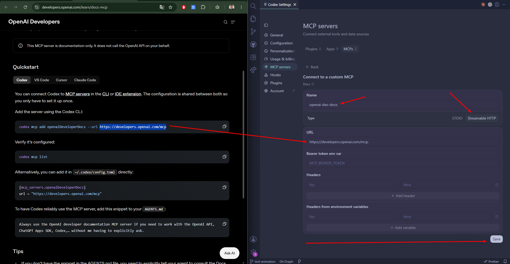

WebDev Agent Kit already directs current OpenAI/Codex questions to the official
Docs MCP, so no additions to `AGENTS.md` are required.

Fallback CLI command:

```powershell
codex mcp add openai-dev-docs --url https://developers.openai.com/mcp
```

```toml
[mcp_servers.openai-dev-docs]
url = "https://developers.openai.com/mcp"
```

## Codex: Playwright

In **Add server**, enter:

| Field | Value |
| --- | --- |
| Name | `playwright` |
| Type | `STDIO` |
| Command to launch | `npx.cmd` |

Add the arguments on separate lines:

```text
-y
@playwright/mcp@latest
```

You can leave Working directory empty.

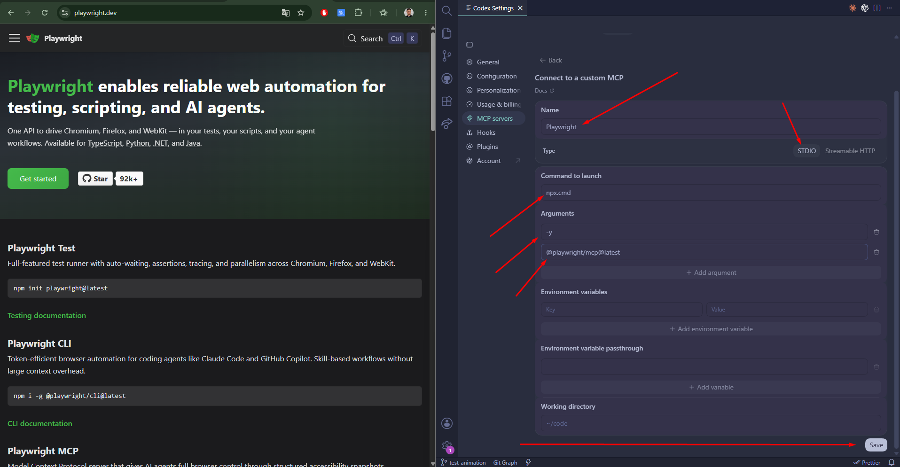

Fallback CLI command:

```powershell
codex mcp add playwright -- npx.cmd -y "@playwright/mcp@latest"
```

```toml
[mcp_servers.playwright]
command = "npx.cmd"
args = ["-y", "@playwright/mcp@latest"]
```

For the first safe `browser_navigate` call, choose **Allow once** if permanent
permission is not required.

## Verify Codex

After saving all servers:

1. Select **Restart extension** or restart VS Code.
2. Start a new Codex thread.
3. Check the enabled servers under **Codex Settings → MCP servers**.
4. If the CLI is available, run:

   ```powershell
   codex mcp list
   ```

5. Run the prompts from the [general MCP verification section](README.md#mcp-verification).

The screenshots below show the expected results specifically in the Codex UI.

### Filesystem

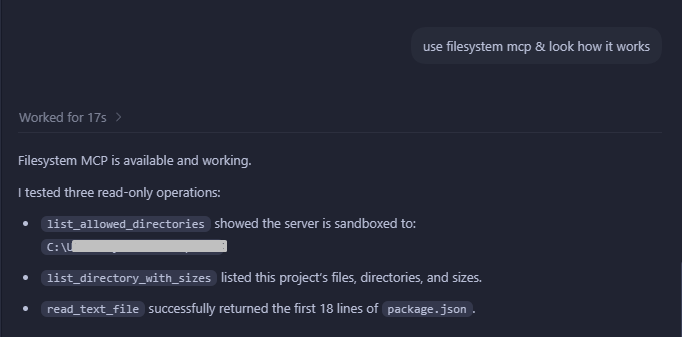

### Context7

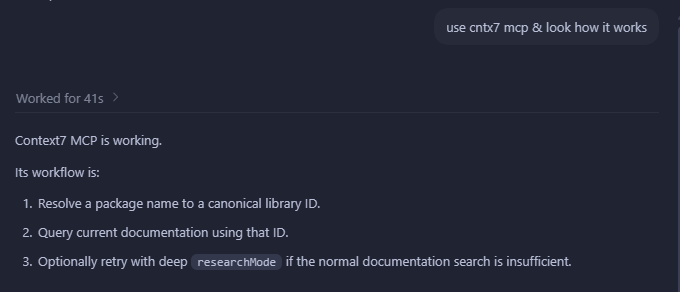

### MDN

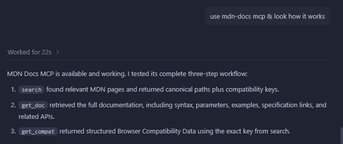

### Playwright Permission

For a one-time test, select **Allow once**.

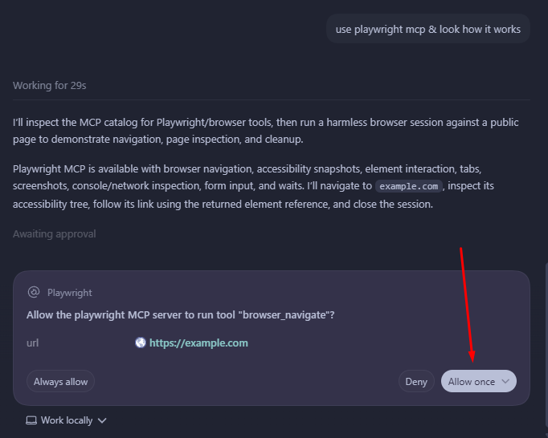

### Playwright Result

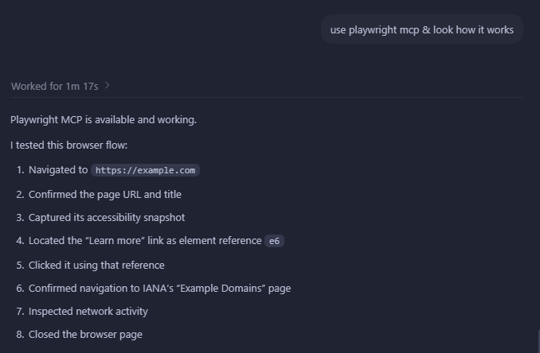

### OpenAI Docs

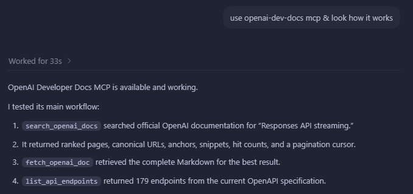

A green toggle and `codex mcp list` confirm configuration but do not replace a
successful tool call in the current session.

Official client MCP configuration reference:
[Codex MCP](https://developers.openai.com/codex/mcp).

[↑ Back to the MCP list](README.md#installation-matrix) · [← All documentation](../README.md)
