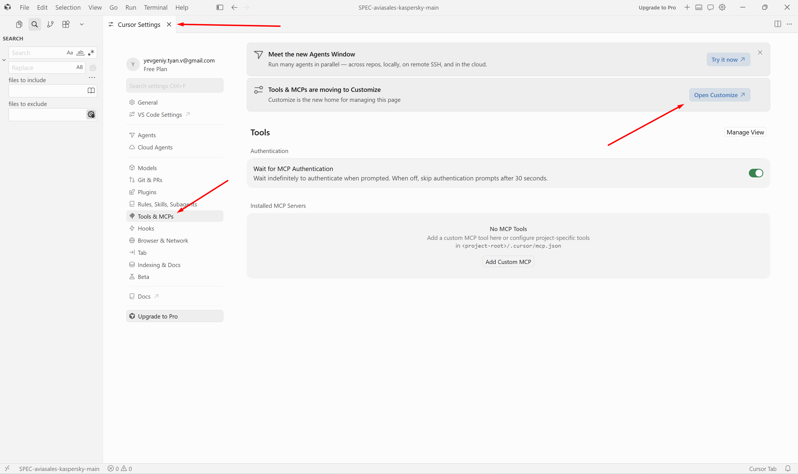
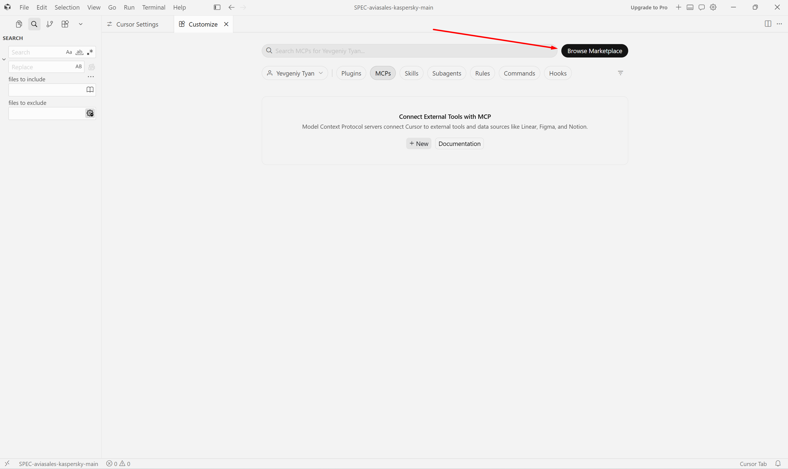
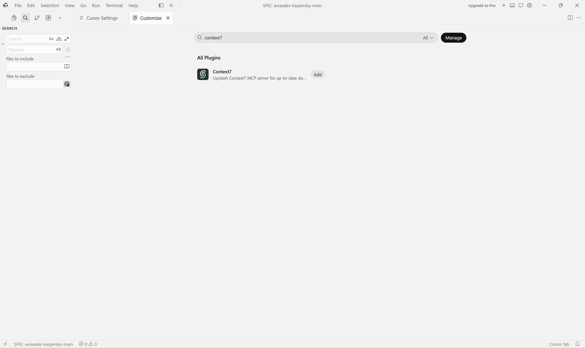
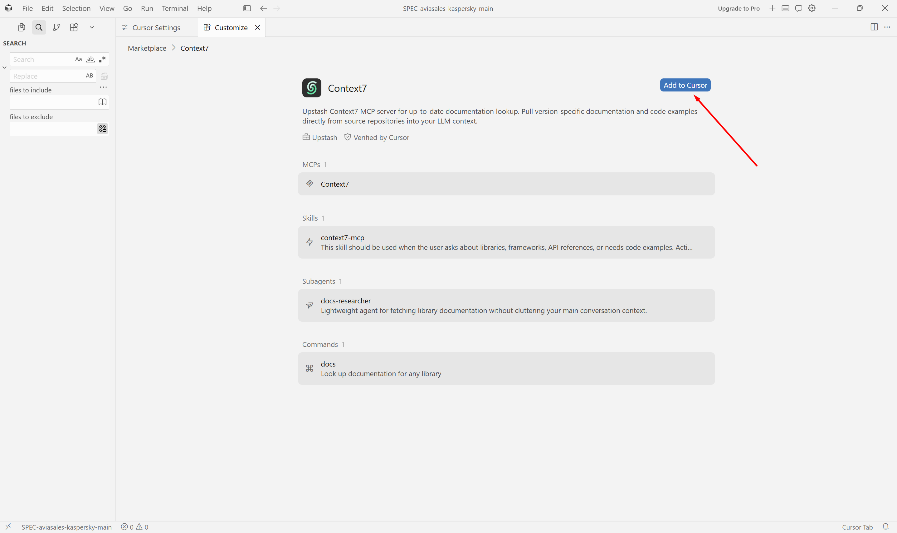
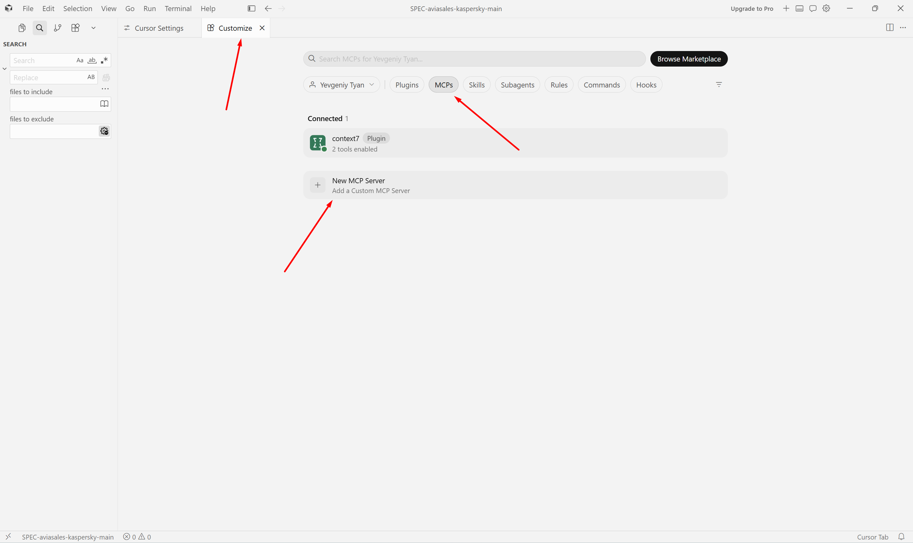
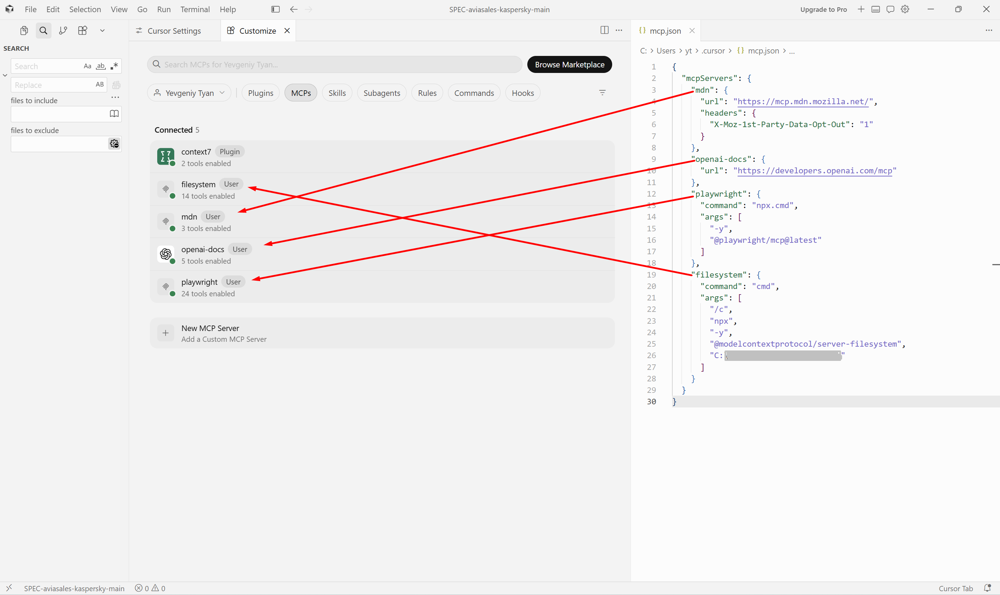
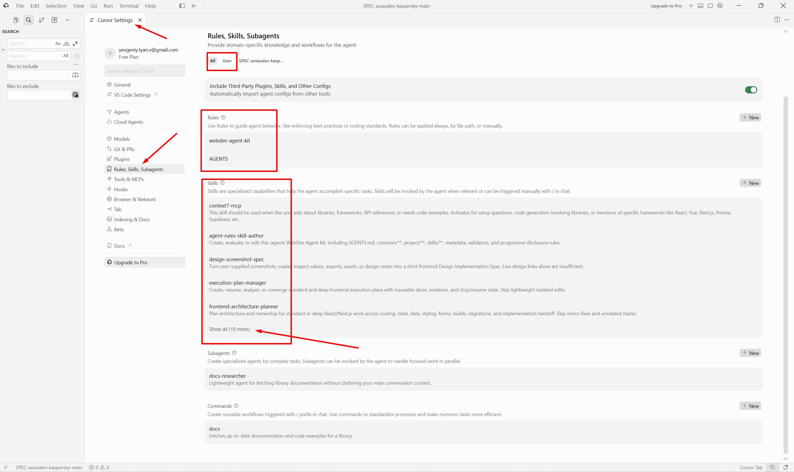

# Install MCP in Cursor

[← All MCPs](README.md) · [Install WebDev Agent Kit for Cursor](../install/cursor.md)

This guide covers MCP installation in Cursor on Windows using the interface
shown in the screenshots. Server purposes, skill relationships, and functional
tests are in the [general MCP guide](README.md).

## Cursor Settings

### Before You Begin

Node.js, npm, and npx must work for Filesystem and Playwright:

```powershell
node --version
npm --version
npx --version
```

### How to Open the MCP Section

1. Open the project in Cursor.
2. Select the gear icon in the top-right corner.
3. In **Cursor Settings**, select **Tools & MCPs**.
4. Select **Open Customize**.



In the window that opens, you can install a verified Marketplace plugin or
create a custom MCP. For Marketplace, select **Browse Marketplace**; for manual
configuration, use the **MCPs** tab and **New MCP Server**.



Cursor supports two configuration locations:

- `~/.cursor/mcp.json` — global MCPs for the current user;
- `.cursor/mcp.json` — MCPs only for a specific project.

The screenshots use global `~/.cursor/mcp.json`. Do not store API keys in a
project file that may be committed to git.

## Cursor: Context7

### Install Through Marketplace

1. In **Customize → Browse Marketplace**, search for `Context7`.
2. Select the result from Upstash marked **Verified by Cursor**.

   

3. Confirm that the card includes the Context7 MCP, the `context7-mcp` skill,
   the `docs-researcher` subagent, and the `docs` command.
4. Select **Add to Cursor**.

   

5. If Cursor opens a browser or displays an authorization request, sign in to
   Context7 and confirm OAuth access.
6. Return to **Customize → MCPs** and make sure `context7` has **Connected**
   status and shows available tools.

   

### Fallback if the Marketplace Plugin Is Unavailable

Do not add the fallback configuration at the same time as the Marketplace
plugin: two identical endpoints will create a duplicate. First disable or remove
the plugin, then add this to `~/.cursor/mcp.json`:

```json
{
  "mcpServers": {
    "context7": {
      "url": "https://mcp.context7.com/mcp/oauth"
    }
  }
}
```

After saving, open the MCP in Cursor and complete OAuth sign-in. If OAuth is
unavailable in your Cursor version, use an API key according to the
[official Context7 instructions](https://context7.com/docs/resources/all-clients)
without storing the key in a published file.

## Cursor: Filesystem

Add this to global `~/.cursor/mcp.json`:

```json
{
  "mcpServers": {
    "filesystem": {
      "command": "cmd",
      "args": [
        "/c",
        "npx",
        "-y",
        "@modelcontextprotocol/server-filesystem",
        "C:\\full\\path\\to\\project"
      ]
    }
  }
}
```

Replace the path with the actual absolute path. Allow only the required project,
not the drive root or the entire user profile.

## Cursor: MDN

Add a remote MCP:

```json
{
  "mcpServers": {
    "mdn": {
      "url": "https://mcp.mdn.mozilla.net/",
      "headers": {
        "X-Moz-1st-Party-Data-Opt-Out": "1"
      }
    }
  }
}
```

The opt-out header disables first-party analytics. The other data-processing
terms for the experimental MDN MCP are described in the
[general document](README.md#mdn-docs).

## Cursor: OpenAI Docs

Add the documentation-only server:

```json
{
  "mcpServers": {
    "openai-docs": {
      "url": "https://developers.openai.com/mcp"
    }
  }
}
```

No API key or headers are required.

## Cursor: Playwright

Add the Windows STDIO configuration:

```json
{
  "mcpServers": {
    "playwright": {
      "command": "npx.cmd",
      "args": [
        "-y",
        "@playwright/mcp@latest"
      ]
    }
  }
}
```

Playwright controls a browser. Verify the URL and action before approving the
tool call.

## Complete mcp.json

If Context7 is installed through Marketplace, global `~/.cursor/mcp.json` should
contain the other four servers. Do not overwrite an existing file blindly:
merge the entries inside its existing `mcpServers` object.

```json
{
  "mcpServers": {
    "mdn": {
      "url": "https://mcp.mdn.mozilla.net/",
      "headers": {
        "X-Moz-1st-Party-Data-Opt-Out": "1"
      }
    },
    "openai-docs": {
      "url": "https://developers.openai.com/mcp"
    },
    "playwright": {
      "command": "npx.cmd",
      "args": [
        "-y",
        "@playwright/mcp@latest"
      ]
    },
    "filesystem": {
      "command": "cmd",
      "args": [
        "/c",
        "npx",
        "-y",
        "@modelcontextprotocol/server-filesystem",
        "C:\\full\\path\\to\\project"
      ]
    }
  }
}
```

Save the file. If the list does not refresh automatically, restart Cursor or
run **Developer: Reload Window** from the Command Palette.

In the screenshot, Context7 has the **Plugin** source and the other servers have
the **User** source:



## Verify Cursor

1. Open **Customize → MCPs**.
2. Make sure all five servers have a green indicator and show tools.
3. If Cursor Agent CLI is installed, run:

   ```powershell
   cursor-agent mcp list
   cursor-agent mcp list-tools context7
   cursor-agent mcp list-tools filesystem
   cursor-agent mcp list-tools mdn
   cursor-agent mcp list-tools openai-docs
   cursor-agent mcp list-tools playwright
   ```

4. Run the prompts from the [general MCP verification section](README.md#mcp-verification).

You can also use **Cursor Settings → Rules, Skills, Subagents** to verify that
WebDev Agent Kit and the Context7 plugin components are visible to the client.
Select **Show all** to expand the complete skill list.



An entry in `mcp.json` does not prove that the server works. Confirmation
requires green **Connected** status, a tool list, and a successful functional
call in a new session.

Official configuration and CLI verification references:
[Cursor MCP](https://docs.cursor.com/context/model-context-protocol) and
[Cursor Agent CLI](https://docs.cursor.com/en/cli/reference/parameters).

[↑ Back to the MCP list](README.md#installation-matrix) · [← All documentation](../README.md)
